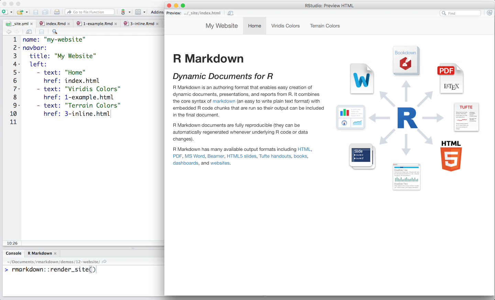
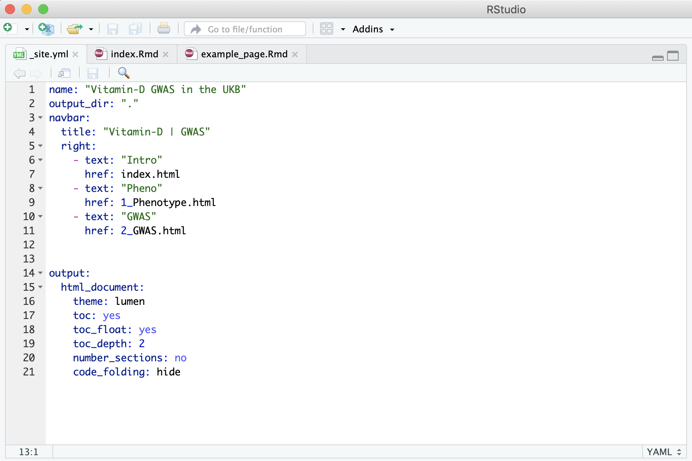

```{r setup, include=FALSE}
knitr::opts_chunk$set(echo = TRUE)
```

<br><br>

# Why have a website
R Markdown websites provide the perfect opportunity to present projects you are working on. They are based on Rmd scripts that you write to run your analyses, so once you’ve set your website up it is easy to update it as you write your code. The main advantages of rendering your Rmd scripts into a website are:

-	Easily accessible platform to present your project
-	Reproducible research
-	Good way of keeping track of what you have done

<br><br><br>

# What you will need
To build an R Markdown website you will need:

  - [RStudio](https://rstudio.com/products/rstudio/download/) installed on your computer
  - A [GitHub account](https://github.com/)
 - Two mandatory files: 
    - **\_site.yml:** This is a configuration file with ‘instructions’ on how the website should look like.
    - **index.Rmd:** This is an Rmd script with content for the first page of your website. You can create a website with one page only, but this is the bare minimum.
  - Other Rmd scripts (Optional): You can add more pages to your website by including additional Rmd scripts (one for each page) in the same directory as the _site.yml and index.Rmd scripts.

Here we will focus only on building the website, so there are no instructions on how to set up your GitHub account and getting it synced with your local machine.

**Note:** The name of the mandatory files needs to be exactly as specified above, so that the files are recognized when you use the command `rmarkdown::render_site()` to render your website.

<br><br><br>

# Configuration {.tabset }
The `_site.yml` file is used to configure how your website is generated. Below are two examples of `_site.yml` files.

 
**Example 1** shows how a `_site.yml` file (left), and what the corresponding website (right) looks like. In that example we have the following fields:

  - **name:** A suggested URL path for your website when it is published (by default this is just the name of the directory containing the site)
  - **navbar**: Instructions on how the navigation bar at the top of the website should look like. In the example above we have:
    - **title:** The title of your website
    - **left:** An option to specify that the website page names should be aligned on the left
        - **text:** The name of each of the pages (how it will appear on the website)
        - **href:** The html file with the content of the page specified in the `text` field immediately above

**Example 2** has a few extra fields, namely:

- **output_dir:** This allows you to specify a directory for the site content to be saved in once the website is generated. If this is not specified, a directory called "_site" is automatically generated. *Note:* To publish your site as a GitHub page you will need this to be "." to keep all content within the root website directory alongside the source code.
- **output:** This field enables you to specify output options that are common to all documents within the website. The options specified here can also be provided in each individual Rmd/page, and will override any options specified here.

## Example 1



Image source: [R Markdown Websites page](https://rmarkdown.rstudio.com/lesson-13.html)

  

<br><br><br>

## Example 2




<br><br><br><br>

# Step-by-step instructions to build and publish your website {.tabset }
## Build website
1.	Create a folder for your project in your local computer. This is where you will save all the scripts that make your website.
2.	Create the `_site.yml` file. Remember to set the output_dir as "." (see example 2, above).
3. Create the `index.Rmd` file
4.	Create any other Rmd files that will generate additional pages/tabs for your website and specify where they go and what they should be called in the `_site.yml`.
5.	If you are in the directory with all your Rmd scripts, build your website with `rmarkdown::render_site()`. Otherwise specify the directory when you execute that command. For example: `rmarkdown::render_site(input="/Path/to/directory")`

When you finish running these steps, you will have all the files that make up your website in the directory you specified. If you open the `index.html` file, for example, you will see a local version of your website. 

<br><br><br>

## Publish website
Once you created your local version of the website, you need to sync the project directory with GitHub. Then, follow the steps below to publish your website:

1. Login to your GitHub account
2. Go to the repository containing your website files
3. Go to settings
4. Scroll down to the "GitHub Pages" section
5. Select the "master branch" as the source (i.e. the master branch should contain all your website files, including the `_site.yml` and `index.html`).

After a few minutes, your website will be published and the corresponding URL will be displayed in the "GitHub Pages" section in green background (see example below). 

<center>

</center>


**Note:** It can take up to 20 minutes for changes to your site to publish after you push the changes to GitHub.

**Note:** Even if your GitHub repository is private, the website will be public, i.e. other people won't be able to see the files on your GitHub repository but they will be able to see the website if given the link.
<br><br><br>

# Useful resources
There are many features that you can add to your website. Below is a list of links to useful online resources that you can explore to build your R Markdown website.

[R Markdown Website instructions](https://bookdown.org/yihui/rmarkdown/rmarkdown-site.html)  
[Markdown Basics](https://rmarkdown.rstudio.com/authoring_basics.html)  
[R Markdown Cheat Sheets](https://rstudio.com/resources/cheatsheets/)  
[R Markdown Website example1](https://www.emilyzabor.com/tutorials/rmarkdown_websites_tutorial.html)
[R Markdown Website example2](https://jules32.github.io/rmarkdown-website-tutorial/index.html)
